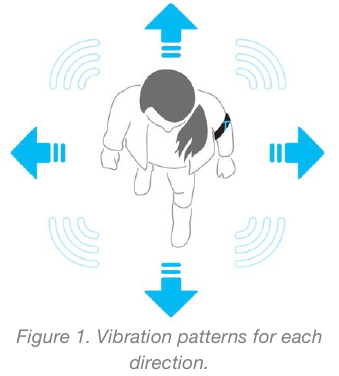
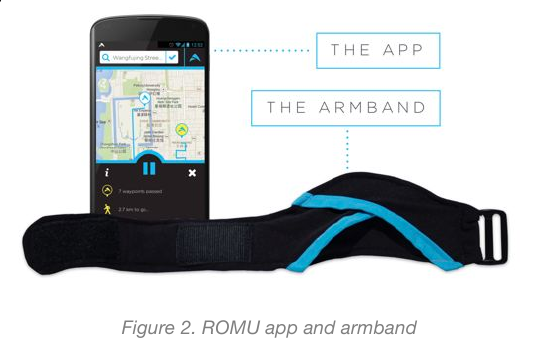
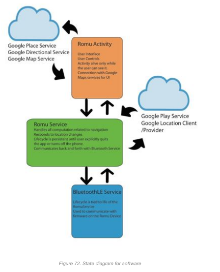
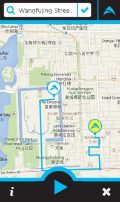

# Romu Description

“The goal is to design and prototype a creative wearable artifact that augments
and extends the capabilities of human and surroundings.”

Just as we have traveled to the far reaches of the wearable tech design space in
our ME 310 exploration, so too have we realized our own needs to travel the far
reaches of the physical world. Be it known or unknown territory, to explore is a
human desire that has stood the test of time and been fundamental (and at times
detrimental) to the development of modern society. With the technology,
infrastructure, and transportation options of today, many people are more mobile
than ever, free to wander wherever time and money will allow. In recognizing
this need, Team Microsoft also found an ideal design direction for which to
build a robust and refined wearable product.

Although mobility is at an all time high, both for leisure and professionally,
there is still the issue of navigating a little known or totally foreign area.
Conveniently, the paper maps of old have been digitized, and even more
conveniently, they can now be accessed on-the-go by anyone with a smartphone -
which today is over half of all Americans. However, receiving directions by
phone is not without complications, especially when on foot. For one, maps apps
can only provide user feedback via auditory or visual means. This not only
detracts from the experience and pleasure of taking in new scenery during
travel, but also puts the user at risk of danger in their surroundings by using
up precious bandwidth on two main sensory pathways. In addition, holding an
expensive phone out to navigate an unknown area openly signals vulnerability.
With this knowledge, gained through social observation, needfinding, and some
experimentation, our team designed a wearable that aims to make pedestrian
travel safer and more immersive through discreet, yet clear haptic navigation
signals. Enter ROMU...

The idea behind the product is simple: people can travel more safely,
efficiently, and enjoyably if they can pay more attention to the world they’re
in. Imagine you travel frequently for pleasure or for your career, but if
possible, always opt to go to new and exciting locations. You have a smartphone
and can get directions to various attractions, but in many areas you fear being
targeted as a tourist and possibly getting your phone stolen. And even if you do
choose to navigate by phone - how can you soak in the sights if you are always
absorbed in your maps app, looking for the next turn? Instead, you put on your
ROMU, plug in your destination to your phone, and go. Vibration signals from the
armband provide directional cues to your end location, allowing you to focus on
the sights and sounds around you. After all, it’s more about the journey than
the destination.

To elaborate on the technology, ROMU is a comfortable, arm-mounted wearable
product containing an array of vibration motors as well as onboard
microcontroller, sensors, and Bluetooth electronics. This hardware package is
accompanied by a software counterpart in the form of an Android application. The
system goes as follows:

1. armband is placed around the upper-left arm and adjusted for comfort and
   orientation, then turned on.
2. The user opens the ROMU app and searches for their device via Bluetooth.
3. Once connected, a destination is searched for and confirmed in the maps view.
4. Once the destination is chosen, a route is drawn and the user may start
   navigation.
5. During navigation, the phone uses various data services to figure out the
   best route, including the position of the next best waypoint (turn).
6. This data is used to send periodic commands to the device, the contents of
   which depend on the bearing and heading of the user.
7. Commands received by the device from the phone are processed by the
   microcontroller and translated to intuitive patterns and arrays of vibrations
   produced by the motors.
8. The user interprets these haptic signals and uses them to successfully
   navigate to the destination!
9. At any point during use, the user may double tap the electronics enclosure on
   the device to pause navigation, or may pause/quit from the phone.

Upon completion of the quarter, ROMU is a functional product and one Team
Microsoft is very proud of. EXPE went smoothly and we received lots of good
feedback about the project - concerning both what people liked and where we had
room for improvement. Overwhelmingly, there was a sense of enjoyment of the
concept and experience behind ROMU. Should future work be performed on the
project, which is currently being discussed by the Stanford team, there is a
desire to fine tune functionality and add several features that were initially
considered but then dropped due to time constraints, including: consolidating
on-band electronics into a PCB (which was attempted by USTC but did not fit the
physical design envelope), reworking the wiring layout, tightening up the
navigation algorithms, and adding a social aspect to app functionality.

# Software Architecture

Shown below is an image describing the overall architecture of the Romu Android
Application. Cloud icons depict regions of the app the rely on internet services
provided by Google. Separate modules are depicted with arrows describing the
communication links between modules.

# UI

Here is a screenshot of what the romu's UI looks like.

